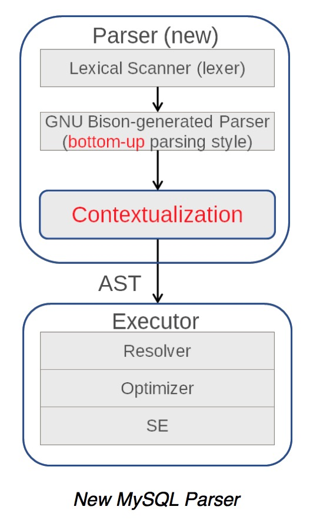
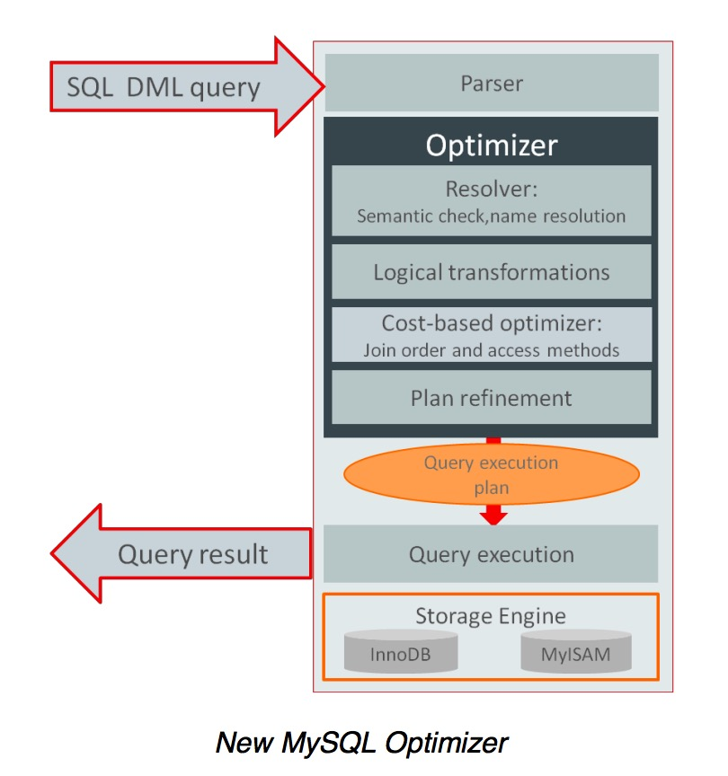
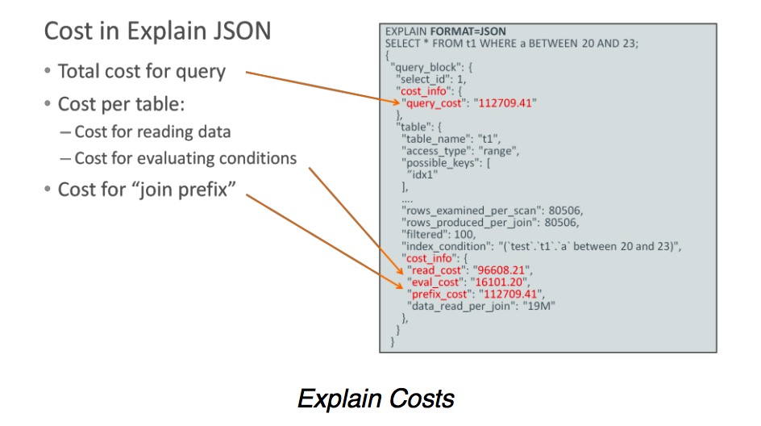
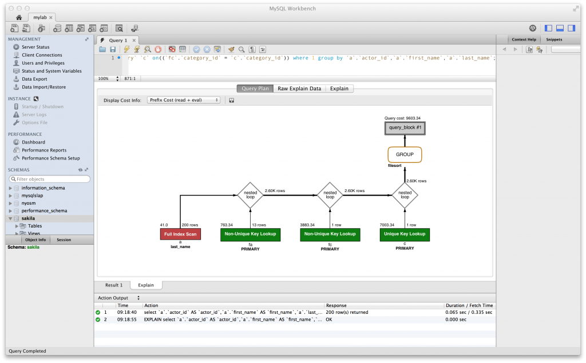

###优化器改进
我们对MySQL的优化器进行了重构，其中parser、optimizer、cost model的大部分模块都进行重写，提升维护性、扩展性和性能。

####优化器代价模型（Optimizer Cost Model）
为了生成一个合理的执行计划，优化器使用代价模型，该代价模型基于估算查询执行过程中产生的消耗。历史上优化器依靠一些在编译时设置的默认优化器常量去决定执行计划。

MySQL5.7中，代价模型被强化为一个动态的、智能的，以便于优化器做出更好的决策。比如，代价模型考虑了新的硬件架构（大容量的buffers&caches，SSDs等）。好的代价模型可以让优化器做出更好的优化决策，进而可以优化查询的性能。

在MySQL5.7中，优化器提供了一个可以配置的数据库用于存储代价策略，便于优化器在生成执行计划时使用。这些策略存储在mysql库的server_cost和engine_cost表中。

详情可以查看:
- [The MySQL Optimizer Cost Model Project](http://mysqlserverteam.com/the-mysql-optimizer-cost-model-project/)
- [Optimizer Cost Model Manual](https://dev.mysql.com/doc/refman/5.7/en/cost-model.html)
- [Optimizer Cost Model Presentation](http://www.slideshare.net/olavsa/mysql-optimizer-cost-model)

####JSON Explain
5.7增强了JSON EXPLAIN的输出，包括了预估的cost信息、预估的需要处理的行数信息。可以帮助DBA去查看不同执行计划之间的区别。

详情可以查看:

- [Optimizer Cost Model Improvements in MySQL 5.7.5 DMR](http://mysqlserverteam.com/optimizer-cost-model-improvements-in-mysql-5-7-5-dmr/)
- [Explain Output Manual](https://dev.mysql.com/doc/refman/5.7/en/explain-output.html)

####Workbench可视化Explain
JSON Explain的输出增强之后，MySQL的客户端可以通过可视化的手段提供给用户更多的信息；MySQL Workbench的可视化Explain就是一个很好的例子。

详情可以查看:

- [MySQL EXPLAIN Explained](http://mysqlserverteam.com/mysql-explain-explained/)

####新的强化后的优化器Hints
5.7优化器的解析规则中增加了新的hint语法；新的hint可以直接写在语句的SELECT, INSERT, REPLACE, UPDATE, DELETE关键字后面，使用类似注释的语法/\*+\*/。这种新的语法不仅会给用户提供了一致、强大、易用的方式去管理hint，同时内部重构之后以便于MySQL后期很方便的增加新的hint。例如在5.7中我们增加了很多索引和join连接的hint。

- [New Optimizer Hints in MySQL](http://mysqlserverteam.com/new-optimizer-hints-in-mysql/)
- [Optimizer Hints Manual](https://dev.mysql.com/doc/refman/5.7/en/optimizer-hints.html)

####语句改写插件（Query Rewrite Plugin）
语句改写插件可以让用户在语句被服务器端执行之前按照用户设置的规则进行改写。比如改写插件可以通过hints来阻止或者强加一些执行计划给原始语句。当你使用ORM框架比如Hibernate或者使用第三方软件比如wiki&jira时，会遇到一些有问题的SQL，但你很难通过修改业务代码来优化这些SQL，这个时候语句改写插件就会是一个非常牛逼的工具。同时提供了两个API用于用户编写自己的语句改写插件。

- [Query Rewrite Plugins](http://mysqlserverteam.com/the-query-rewrite-plugins/)
- [Write Yourself a Query Rewrite Plugin Part 1](http://mysqlserverteam.com/write-yourself-a-query-rewrite-plugin-part-1/)
- [Write Yourself a Query Rewrite Plugin Part 2](http://mysqlserverteam.com/write-yourself-a-query-rewrite-plugin-part-2/)

###Generated Columns

Generated Columns一般情况是一种虚拟的列，数据并不会存储在表中；除非你在定义的时候声明该列是STORED。该功能提供了一种便捷的途径去“缓存”一些经常需要通过计算才能获得的值；并且通过STORED Generated Columns你可以实现类似“函数索引”的功能（STORED Generated Columns可以作为索引的一部分，会在数据发生更新的时候被更新并存储）；当你将该功能和schema-less列混合使用的时候会方便很多，比如json。

详情可以查看:

-. [Generated Columns in MySQL 5.7.5](http://mysqlserverteam.com/generated-columns-in-mysql-5-7-5/)
-. [Create Table Manual](http://dev.mysql.com/doc/refman/5.7/en/create-table.html)

###服务器端语句执行超时
提供可以设置语句执行超时功能，可以进行全局设置、连接设置，也可以针对单个的语句进行设置。例如：

	SET GLOBAL MAX_EXECUTION_TIME=1000;
	SET SESSION MAX_EXECUTION_TIME=1000;
	SELECT /*+ MAX_EXECUTION_TIME(1000) */ * FROM my_table;
	
	root@test05:16:41>select * from test order by rand() limit 10;
	ERROR 1028 (HY000): Sort aborted: Query execution was interrupted, maximum statement execution time exceeded
	
	
该功能只对read-only的语句起作用；同样对与stored programs（存储过程、触发器、定时器等）中的语句也不起作用；注意如果sleep被该参数限制的时候会返回1，不会报超时错误。
	
详细信息可以查看：

1. [Server Side SELECT Statement Timeouts](http://mysqlserverteam.com/server-side-select-statement-timeouts/)